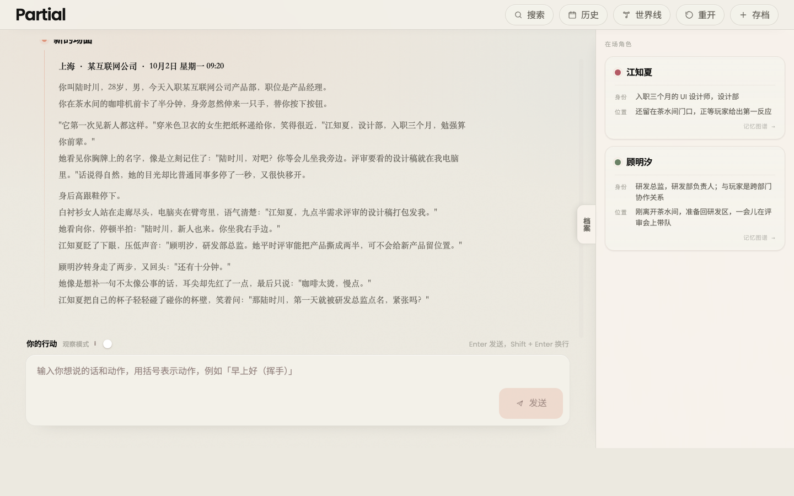

# DeepRole

<p align="center">
  
</p>

DeepRole 是一个开放世界多 Agent 角色扮演 / 叙事引擎。玩家和角色生活在同一个会持续变化的游戏世界里：你可以自由行动、主动找人、离开当前场景、跳过时间、改变关系走向；角色会根据自己的性格、目标和已经经历过的事情作出回应。

引擎的核心目标是 **「每次游玩都生成一条不一样的故事线」** —— 即使是同一个角色，也会因为遇到的玩家不同、经历的事件不同、被对待的方式不同，慢慢展现出不一样的面貌。

当前承载的示例剧本是 **《Partial · 偏心》**：现代职场双女主恋爱故事，玩家以产品经理身份入职，与 UI 设计师江知夏、研发总监顾明汐在跨部门协作中逐渐失衡、靠近、确认。

---

## 为什么要做这个项目

传统 AI-BOT 角色扮演游戏有几个绕不开的痛点，玩家通常在 20 轮左右的对话后流失：

1. **长对话失忆** —— 角色记不住早先发生过的事，对话越长越"断层"。
2. **多角色串台** —— 几个角色共用一段上下文，互相知道不该知道的事，人设混在一起。
3. **剧情无推进** —— 永远是"玩家说一句、角色回一句"的纯闲聊，没有目的地。

市面上的解法多是"把上下文窗口塞得更大、把人设 prompt 写得更长"。DeepRole 认为 **问题不在上下文长度，而在结构**：记忆、信息流、推进节奏如果都靠 LLM 即兴处理，再多 token 也撑不住长线故事。所以这个项目从架构上重新设计这三个维度：

- **记忆** 用分层压缩 + 精准召回，而不是整段历史塞进上下文。
- **信息** 按 `visible_to` 在角色间隔离，而不是所有人共享一段对话。
- **推进** 由导演 Agent + 系统议程双驱动，而不是只等玩家发话。

下面这些设计都是围绕这三个问题展开的。

---

## 设计特点

### 1. 导演 Agent 路由 + 用户输入与系统议程双驱动

每一轮不是"玩家讲话 → 角色回话"，而是先跑一个 **narrator（旁白）Agent**：它不替角色说话，只决定这一轮**谁能看见并回应**（`targets`）、时间地点在场、场景转换、是否引入新角色。随后各角色**顺序**回应，每人写回历史后下一个才能读到——信息按在场关系轮流扩散。

推进机制是双驱动的：

- **用户输入**驱动玩家主动行为。
- **系统议程**驱动世界自己往前走：`state_updater` 维护 `world_schedule`（世界日程）与 `pending_events`（从角色"打算"同步来的待触发事件队列）。时间到了、或某个角色"打算去找玩家"的条件成立时，系统会主动推进到下一幕，而不是等玩家再发一条消息。

效果是：你可以一整天不找某个角色，但她真的会自己来找你。

### 2. 信息不对称（visible_to）

每条历史消息都带 `visible_to` 字段，角色读取上下文时**按在场关系过滤**。不在场的人不知道这轮发生了什么。

这不是靠在 prompt 里写"角色 A 不应该知道 X"，而是在数据层就让 A 看不到那条消息。结果自然产出误会、秘密、试探、补救空间：你可以坦白、隐瞒、拖延、解释，也可以利用角色之间知道的信息不同来推动剧情。

这是 DeepRole 相对普通聊天框架最独特的地方——**人设不是靠提示词约束的，而是靠信息可达性塑造的**。

### 3. 角色认知四层

| 层 | 载体 | 作用 |
|----|------|------|
| **Soul** | `soul.md`（identity / goal / past / habits / reactions / voice 六段） | 只读人设，本轮不变 |
| **status** | `status.md`（prose fields） | 心境、在意的事、关系，每轮回写 |
| **EpisodeMemory** | `memory.jsonl` | 一事件一条，带 date / participants / keywords / importance / raw_dialogue 等结构化字段 |
| **Understanding** | `understanding.jsonl` | 从事件沉淀出的**稳定信念 / 互动模式**，带 history 记录内容演变 |

人设不会因为一场对话就崩——它在 Soul 里是只读的；但角色也不会停在初始设定里——每次冲突、承诺、失约都会进 EpisodeMemory，再被后台压缩成 Understanding，影响后续判断。同一个角色在不同世界线里可能变得更信任你、更疏远你、更依赖你，这种感觉来自一路发生过的事，而非开局人设。

### 4. 混合记忆检索

单轮记忆召回走一条完整管线：

```
向量语义候选  +  BM25 词面候选  →  hybrid 融合  → (可选) rerank 精排
→ 叠加 recency 指数衰减(游戏内日期 + recall 双信号) + importance 权重
→ 回写 last_recalled_at
```

- 向量库是本地 **sqlite-vec**，零外部依赖。
- recency 用**游戏内日期**而非墙钟时间，半衰期可配；配合 importance 权重，让"重要的旧事"不会单纯因为时间久就被遗忘。
- BM25 用 jieba 分词，hybrid 默认 75% 向量 / 25% 词面，兼顾语义相似和关键词命中。

效果：上下文窗口里不必常驻全部历史，老的对话被压成结构化事件，召回时按相关性 + 时间近度取——同等窗口下能承载更长故事弧线。

### 5. 后台记忆整理 consolidation

每轮结束，`detect_and_consolidate` 与 state_updater 并行后台运行：

- **EpisodeClosureDetector** 扫描谁有可结的剧情弧段（一个事件弧没落、或被新事件覆盖）。
- 阈值到了的角色并行跑 **EpisodeMemoryGenerator**：切片 draft + 原始对话 → 生成一条结构化 EpisodeMemory 追加进 `memory.jsonl`，顺便 patch Understanding（带 history 演变记录、回链 episode id）、同步向量索引。

整理在后台异步进行，玩家不必等它结束才能继续——这是"长线游玩不卡顿"的关键。

### 6. 开放世界推进 + 动态角色孵化

玩家不需要沿固定剧情树走。你可以在当前场景继续对话，也可以转身离开、给别人发消息、去另一个地点、等到晚上、临时改计划。系统会根据当前世界状态接住这些行动。

当剧情需要新长期人物时，narrator 会向 **`character_factory`** 提出带关系锚点的请求，自动生成新角色的 soul / status / memory 并加入本轮。进入主要关系网络的新角色会持续参与后续剧情，拥有自己的记忆和变化。

### 7. 不可变世界线存档

存档是**不可变节点 zip**，父子关系只存 metadata。读取会从某个节点分出新分支，不会覆盖原节点。世界线页面按故事分 tab 展示存档树，能看到同一分支和分叉点。

建议在关键关系节点前存档：表白、摊牌、分别、冲突升级、引入新角色之前。想看角色变化时，不要频繁重开——让同一条世界线多走一段。

### 8. 四层分层架构（AST 守依赖）

```
models/        ← 纯领域（实体 + 值对象 + 规则，零 I/O）
repository/    ← 基础设施（文件 / sqlite-vec / LLM 客户端 / 日志）
app/           ← 用例层（单轮编排 + agent 装配 + LLM DTO）
server.py      ← 投递层（FastAPI / SSE）
```

`tests/test_layer_dependencies.py` 用 AST 静态守这条依赖方向，任何反向 import 会让测试直接失败——让"领域规则不污染 I/O、I/O 不反依赖用例"能长期不腐烂。所有结构化输出走 pydantic-ai `PromptedOutput`，DTO 在 app/ 解包成 primitive 再喂 repo，repo 永远不 import app/。

---

## 项目结构

```
DeepRole/
├── models/              # 领域实体（Character / EpisodeMemory / Understanding...）
├── repository/          # 基础设施（文件、sqlite-vec、LLM/embedding/rerank 客户端、日志）
├── app/                 # 用例层（conversation / narrator / consolidation / memory / character_factory）
├── prompts/             # LLM prompt 资源
├── data/templates/      # 故事模板（当前：modern / Partial·偏心）
│   └── modern/
│       ├── narrator/    # 旁白 soul + status + tasks（剧情种子）
│       ├── chenxiao/     # 江知夏 soul/status/intents/memory_draft
│       └── guyining/     # 顾明汐 soul/status/intents/memory_draft
├── static/              # 前端（Alpine.js SPA + Anthropic 风格 CSS）
├── server.py            # FastAPI 投递层 + SSE
├── config.toml          # 行为配置（记忆权重、历史阈值、温度等）
└── .env.example         # 模型 / embedding / rerank 配置模板
```

---

## 快速开始

### 1. 环境与依赖

需要 Python ≥ 3.11。可用 `uv` 或 `conda` 二选一：

```bash
# 方式 A：uv（项目原生）
uv sync

# 方式 B：conda（无 uv 时）
conda create -n deeprole python=3.12 -y
conda activate deeprole
pip install "pydantic-ai==1.79.0" openai python-dotenv tiktoken httpx jieba \
            sqlite-vec aiosqlite fastapi uvicorn pydantic-settings asyncpg bcrypt sseclient
```

### 2. 配置模型服务

```bash
cp .env.example .env
```

打开 `.env`，填入模型配置。最少需要主对话模型与 embedding 服务：

```bash
LLM_PROVIDER=openai                       # 任意 OpenAI 兼容端点填 openai + LLM_API_URL
LLM_API_URL=https://api.siliconflow.cn/v1 # 自定义端点；走官方 api.openai.com 则留空
LLM_API_KEY=your-api-key
LLM_MODEL_ID=deepseek-ai/DeepSeek-V4-Flash  # 角色扮演表现好的便宜模型；亦可换其他

EMBEDDING_API_URL=https://api.siliconflow.cn/v1/embeddings
EMBEDDING_MODEL=BAAI/bge-m3
EMBEDDING_API_KEY=your-embedding-key        # 与 LLM 同源时可复用同一个 key

RERANK_MODEL=BAAI/bge-reranker-v2-m3       # 可选；不配则跳过精排
RERANK_API_URL=https://api.siliconflow.cn/v1/rerank
RERANK_API_KEY=your-rerank-key             # 与 LLM 同源时可复用同一个 key
```

支持 provider：`openai`（含任意 OpenAI 兼容端点）/ `google` / `anthropic` / `deepseek`。详细字段见 `.env.example` 注释。

### 3. 启动

```bash
# uv
uv run uvicorn server:app

# conda
python -m uvicorn server:app
```

打开 http://localhost:8000 ，选择故事模板即可开始。

---

## 开始游玩

进入页面后选择一个故事模板：

- **`modern`（不期而遇）** —— 现代都市恋爱，初始双女主为江知夏（UI 设计师）和顾明汐（研发总监），玩家以产品经理身份入职，三人因跨部门协作被拉到一起。

选择故事后，直接在输入框里说话或描述行动即可。

**台词**：

```text
"你今天看起来有点累，要不要一起去天台吹会儿风？"
```

**动作**（用括号表示）：

```text
（把手机扣在桌上，假装没看到那条消息）
```

**改变场景 / 跳过时间**：

```text
（去找江知夏）
（等到晚上十点，给江知夏发消息）
```

每轮角色回应后，页面会在后台生成几个**可选行动**；选项没出现时也可以直接输入。你可以点选项继续，也可以自己输入完全不同的内容——输入框永远可用。

### 观察模式

角色创建后，输入区会出现 **观察** 开关。开启后输入想观察的角色名，系统会布置一个**没有玩家入场**的场景，让在场角色自然互动；观察轮不会生成玩家行动选项。适合用来"看角色自己怎么演"。

### 推动开放世界体验

想看到 DeepRole 的差异，可以多尝试：

- 指定想找谁、说明自己要去哪里。
- 明确是当面说、发消息、打电话，还是只在心里想。
- 让角色之间产生交集，例如邀请两个人同时出现。
- 做一些会留下后果的选择：失约、隐瞒、道歉、承诺、公开关系。

这些行为会改变角色知道什么、记住什么，以及之后如何对待你。想看角色变化时，不要频繁重开——让同一条世界线多走一段。

### 存档与世界线

页面提供统一的档案抽屉和世界线页面，用不可变节点管理存档：

- **新建存档**：生成一个新的世界线节点；若当前进度来自旧存档，新节点会挂在旧节点下方。
- **世界线**：按故事分 tab 展示存档树，能看到同一分支和从哪个节点分叉。
- **读取**：恢复过去的世界线节点；之后继续保存会从该节点分出新分支。
- **删除**：可删整个 Game，也可删没有子分支的叶子节点。
- **重开**：清空当前进度，从故事模板重新开始。

---

## 技术栈

- **后端**：FastAPI + pydantic-ai（PromptedOutput 结构化输出）+ aiosqlite / sqlite-vec
- **记忆**：本地 sqlite-vec 向量库 + BM25（jieba 分词）+ 可选 rerank
- **前端**：Alpine.js SPA + Anthropic 风格视觉系统（暖米 `#ECE9E0` + 克制橙 `#D97757` + Lora/Poppins + 霞鹜文楷）
- **模型**：任意 OpenAI 兼容端点（DeepSeek / SiliconFlow / OpenAI / Anthropic / Google ...）

---

## License

MIT