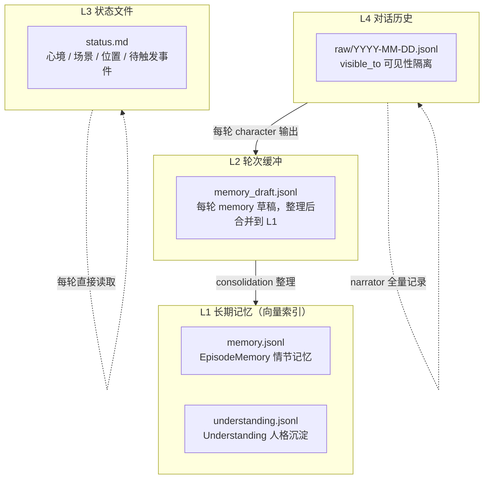
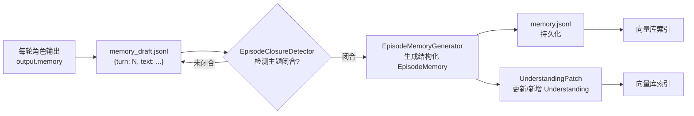
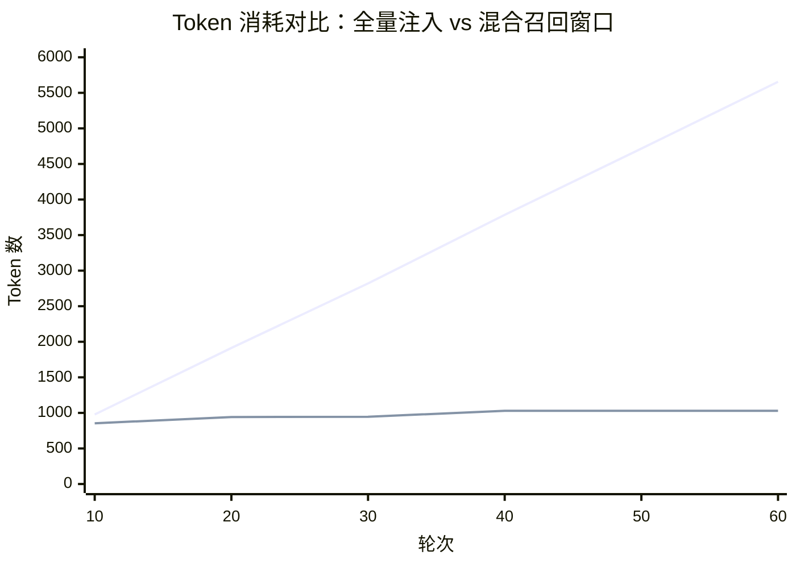
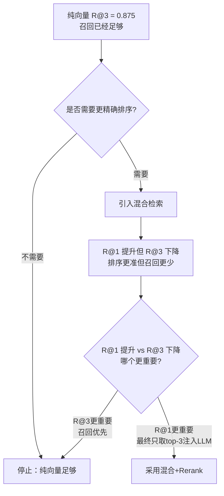

# 多 Agent 角色扮演游戏中的记忆系统设计：从架构到评测的完整实践

## 开篇：为什么记忆系统是多 Agent 游戏的核心

在传统的单 Agent 对话系统中，"记忆"通常意味着把最近几轮对话拼进 prompt。但在多 Agent 角色扮演游戏里，情况完全不同——多个角色各自维护独立记忆，角色之间信息不对称，玩家和一个角色说过的话，另一个角色未必知道。

这就引出了一个问题：**如何让 LLM 在正确的时间、以正确的视角、"记起"正确的事？**

这个问题的答案，决定了角色扮演的深度和连贯性。如果记忆系统做得粗糙，角色会"失忆"、会"串戏"、会"人设崩塌"；如果做得精密，角色能记住一个月前的某个下午、那条没回的消息、那个没有说出口的眼神。

本文记录了 DeepRole 项目在记忆系统设计上的完整实践：从四层记忆架构的设计，到三种检索方案的对比，到评测集的构造，再到实验数据给出的结论。

---

## 第一章：记忆系统的四层罗盘设计

### 1.1 记忆层次总览

DeepRole 的记忆系统由四层组成，每层有明确的职责边界：



| 层级 | 文件 | 职责 | 检索方式 |
|---|---|---|---|
| L1 长期记忆 | `memory.jsonl` / `understanding.jsonl` | 持久化的事件和信念 | 向量检索 |
| L2 轮次缓冲 | `memory_draft.jsonl` | 每轮 memory 草稿 | 不检索，等待整理 |
| L3 状态文件 | `status.md` | 当前心境/场景/位置 | 直接读取，不检索 |
| L4 对话历史 | `raw/YYYY-MM-DD.jsonl` | 原始对话记录 | 按可见性过滤后截取 |

**设计原则**：只有 L1 走向量检索，其他三层要么不检索（L2 等待整理），要么直接读取（L3），要么按规则截取（L4 按高/低水位窗口 + visible_to 过滤）。

### 1.2 情节记忆（EpisodeMemory）

EpisodeMemory 是角色的"自传体记忆"——记录具体发生过的事件。

```json
{
  "id": "a1b2c3d4e5f6",
  "date": "10月3日",
  "time": "10月3日 18:30",
  "location": "三号会议室",
  "participants": "江知夏、玩家",
  "keywords": ["评审", "留下", "收拾图纸", "独处"],
  "importance": 4,
  "content": "评审结束后大家都走了，我说'我帮你整理设计稿'。其实只是想多待一会儿。会议室里只剩我们两个人，窗外的天已经暗了。",
  "memory_owner": "chenxiao",
  "title": "评审后的独处",
  "raw_dialogue": "[turn=5] 江知夏: ...",
  "last_recalled_at": "10月5日"
}
```

关键字段说明：
- `id`：稳定 UUID，用于向量库索引和 Understanding 的 `linked_episodes` 关联
- `importance`：1-5 重要度，参与最终排序分数计算
- `raw_dialogue`：原始对话片段，作为可追溯的 metadata 保留，**不参与向量索引**
- `last_recalled_at`：最近一次被召回的游戏日期，用于模拟"遗忘"的时间衰减

### 1.3 人格沉淀（Understanding）

如果说 EpisodeMemory 记录的是"发生了什么"，那 Understanding 记录的就是"我因此理解了什么"。它是角色的"稳定认知"——跨事件的信念、行为模式、关系判断。

```json
{
  "id": "f7e8d9c0b1a2",
  "memory_owner": "chenxiao",
  "subject": "她的表达方式",
  "keywords": ["行动代替言语", "早起买咖啡", "加班披外套"],
  "content": "她习惯用行动表达关心，而非言语。早起买咖啡、加班披外套、评审后找借口留下。",
  "linked_episodes": ["a1b2c3d4e5f6", "g3h4i5j6k7l8"],
  "history": [
    {
      "episode_id": "a1b2c3d4e5f6",
      "date": "10月3日",
      "title": "评审后的独处",
      "content": "她习惯用行动表达关心，而非言语。早起买咖啡、加班披外套、评审后找借口留下。"
    }
  ]
}
```

Understanding 和 EpisodeMemory 的核心区别：

| 维度 | EpisodeMemory | Understanding |
|---|---|---|
| 记录的是什么 | 单次具体事件 | 跨事件的稳定认知 |
| 数量增长 | 持续 append | 少而精，通过 patch 增量更新 |
| 更新方式 | 只追加不修改 | 可 add / update / 关联新事件 |
| history 字段 | 无 | 有，记录每次内容变化的快照 |
| linked_episodes | 无 | 有，指向支撑这条认知的事件 |

### 1.4 轮次缓冲：记忆如何"生长"

记忆不是每轮都直接写入 L1 的。它的生命周期是：



这个"缓冲 → 整理 → 持久化"的流程，模拟了人类记忆的"短期记忆 → 长期记忆巩固"过程。不是每句话说完就值得记住，只有当一个互动主题完成闭环后，才值得固化为一条长期记忆。

### 1.5 对话历史与可见性隔离

L4 对话历史是唯一的"单数据源"——所有对话消息只写入 narrator 的 raw JSONL 文件，但每条消息携带 `visible_to` 字段：

```json
{
  "role": "chenxiao",
  "content": "你在干嘛？没什么，就是想你了——你要是忙就不用回。",
  "visible_to": ["chenxiao", "player", "narrator"],
  "turn": 7
}
```

当顾明汐读取上下文时，她会过滤掉 `visible_to` 中没有 "guyining" 的消息——这是信息不对称的基石。角色不在场景里，就看不到那轮对话。

**为什么对话历史不走向量检索？** 因为对话是时间线性的，需要连贯的上下文。向量检索会打乱顺序，丢失"谁说的、在什么场景下说的"的连续性。对话历史通过高/低水位窗口截取最近的 N 个 turn，保证上下文的完整和连贯。

### 1.6 设计哲学：为什么是四层而不是一层？

一个自然的疑问是：为什么不把所有信息都堆进向量库，统一检索？

答案在于**检索的不确定性**。向量检索是概率性的——它可能在 top-3 中遗漏重要信息，也可能召回完全不相关的内容。对于以下信息，你不能容忍这种不确定性：

- **当前场景/时间**：必须100%准确，不走检索，直接读 status.md
- **最新对话**：必须时序完整，不走检索，按窗口截取
- **待触发事件**：必须精确管理，不走检索，用类型化列表

只有**长期记忆**适合向量检索——因为它的特点是"大部分时候不需要想起，但在特定的情境下需要被关联起来"。这种"概率性召回"正是向量检索的强项。

---

## 第二章：长期记忆召回的三种方案

### 2.1 问题定义

每轮对话开始时，系统需要为当前角色检索长期记忆：

```
输入：
  - 当前角色的在意的事（status.md）
  - 最近可见的 narrator 场景描述（提取 location）
  - 玩家本轮输入

输出：
  - top-3 条最相关的 EpisodeMemory
  - top-3 条最相关的 Understanding
  → 注入 prompt 的 <relevant_memories> 和 <relevant_understandings> 块
```

核心挑战有两个：
1. **口语改述**：玩家用日常口语表达，和记忆文本用词完全不同
2. **纠缠记忆**：多条记忆主题相近，但只有一两条能回答当前问题

### 2.2 方案一：纯向量检索

**原理**：把 query 和记忆都编码成向量，计算 cosine similarity，取 top-k。

```
query → bge-m3 embedding → 1024 dim vector
                              ↓
                         cosine similarity
                              ↓
                    memory embedding (1024 dim)
                              ↓
                         sort by score
                              ↓
                          top-3 results
```

**代码实现**（简化版）：

```python
def search_vector(all_mems, qvec, limit):
    scored = sorted(
        ((cosine_sim(qvec, m.embedding), m.id) for m in all_mems),
        reverse=True
    )
    return [mid for _, mid in scored[:limit]]
```

**优点**：
- 语义理解强——"她在找我" 和 "她在找我" 的 embedding 很接近
- 对口语改述友好——不依赖关键词匹配

**缺点**：
- **聚类效应**：主题相近的记忆（如"两人独处"主题）embedding 分数会很接近，无法精确区分哪条才是真正相关的
- **抽象概念失效**：query 里的"不善表达""总用行动代替说话"等抽象概念，在记忆文本里根本没出现，embedding 模型只能做"主题级"的近似匹配

### 2.3 方案二：向量 + BM25 混合检索（Hybrid RRF）

**原理**：同时跑向量检索和 BM25 关键词检索，用 RRF（Reciprocal Rank Fusion）融合两个排名列表。

```
        query
       /      \
  向量检索    BM25 检索
  [m01,m03,   [m03,m09,
   m05,m09]    m01,m06]
       \      /
       RRF 融合
       /      \
   1/(60+rank) + 1/(60+rank)
              ↓
        融合排名
              ↓
         top-10 候选
```

**RRF 融合公式**：

```python
def rrf_fusion(vec_ids, bm25_ids, k=60):
    scores = {}
    for rank, mid in enumerate(vec_ids):
        scores[mid] = scores.get(mid, 0) + 1.0 / (k + rank + 1)
    for rank, mid in enumerate(bm25_ids):
        scores[mid] = scores.get(mid, 0) + 1.0 / (k + rank + 1)
    return sorted(scores.keys(), key=lambda x: scores[x], reverse=True)
```

**为什么选 RRF 而非加权求和？** 向量的 cosine similarity 在 [0,1] 区间，BM25 的 rank 值是负数（FTS5 的 bm25() 返回值越小越相关）。两者分数尺度不一致，直接加权需要做 min-max 归一化，引入额外的归一化噪声。RRF 只看排名不看分数，天然解决尺度问题。

**优点**：
- 关键词精确匹配 + 语义理解互补
- 当 query 含有具体人名/地点/道具时，BM25 能精确命中

**缺点**：
- BM25 对口语改述无效（改述后词面完全不同）
- 如果 BM25 命中了错误的关键词匹配（"陷阱记忆"），会污染融合结果
- 增加了 FTS5 索引维护的复杂度

### 2.4 方案三：向量 + BM25 + Rerank 精排

**原理**：在混合召回的基础上，用 Cross-Encoder 对 top-10 候选重新打分排序。

```
向量召回 top-15 ──┐
                   ├──→ RRF 融合 → top-10 → Cross-Encoder → top-3
BM25 召回 top-15 ──┘                              ↓
                                           query + doc 一起输入
                                           理解深层语义关系
                                           重新计算 relevance score
```

**双编码器 vs 交叉编码器**：

| 维度 | 双编码器（Embedding） | 交叉编码器（Rerank） |
|---|---|---|
| 输入 | query 和 doc 独立编码 | query 和 doc 一起输入 |
| 计算 | 可以离线预计算 doc 向量 | 每次都要实时计算 |
| 速度 | 极快（向量乘法） | 较慢（神经网推理） |
| 理解力 | 主题级语义近似 | 深层语义关系推理 |
| 适用 | 大规模召回 | 小规模精排 |

Cross-Encoder 能理解"不善表达" 和 "用行动代替言语" 是同一件事——这是双编码器做不到的。代价是每条候选都要调用一次 API，延迟增加约 200-400ms。

### 2.5 三种方案的对比总结

| 维度 | 纯向量 | 混合 RRF | 混合+Rerank |
|---|---|---|---|
| 语义理解 | 强 | 强 | 强 |
| 关键词精确 | 弱 | 中 | 中 |
| 深层推理 | 弱 | 弱 | 强 |
| 延迟 | 最快 | 快 | 较慢（+API 调用） |
| 复杂度 | 低 | 中 | 高 |
| 适用规模 | 全量 | 全量 | 仅 top-10 候选 |

**实际使用时**，三种方案通过配置一键切换：

```toml
# config.toml
[vector]
hybrid_search_enabled = true   # true=混合检索, false=纯向量
```

```env
# .env
# 不配置 RERANK_MODEL 则跳过 rerank 步骤
RERANK_MODEL=BAAI/bge-reranker-v2-m3
```

| 模式 | config.toml | .env RERANK_MODEL |
|---|---|---|
| 纯向量 | `hybrid_search_enabled = false` | 留空 |
| 向量+BM25 | `hybrid_search_enabled = true` | 留空 |
| 向量+BM25+Rerank | `hybrid_search_enabled = true` | 填模型名 |

---

## 第三章：评测集设计——如何制造"纠缠记忆"

### 3.1 评测的目标

评测集要回答的核心问题是：**检索系统能否从"主题相近但细节不同"的记忆中，找到真正能回答当前问题的那条？**

如果记忆之间完全不相关（比如"设计稿延期"和"技术选型"），任何检索方案都能轻松命中。真正的挑战在于**纠缠**——同一件事的不同视角、同一种情绪的不同表达、同一个道具的不同含义。

### 3.2 记忆构造原则

基于《不期而遇》的剧本，我们构造了 24 条记忆（12 条 EpisodeMemory + 12 条 Understanding）：

**构造原则**：
1. **短而独特**：每条 30-50 字，聚焦单一事件或概念
2. **制造纠缠**：同事件多角色视角 + 同地点多事件 + 同道具多含义
3. **设置陷阱**：trap 记忆与 target 共享关键词但描述不同事件

**纠缠类型示例**：

```
场景：初见（10月2日 茶水间）
同一杯咖啡，三个角色各记一笔：
- e01 (江知夏): 帮她按了咖啡机按钮，她递纸杯时说了句"勉强算你前辈"
- e02 (顾明汐): 路过茶水间时看到江知夏正把纸杯递给新来的产品经理
- trap: 周末在茶水间遇到她，她说"这机器总卡" ← 同地点+同动作，但不同事件
```

```
场景：楼梯间（贯穿 4 个不同日期）
同一地点，完全不同的事件：
- 10月5日: 电梯口三人沉默，她走楼梯
- 10月10日: 她评审被否定后躲在这里哭
- 10月10日: 她收到纸巾
- 10月11日: "你怎么知道我在这里" ← 重逢
```

### 3.3 记忆示例

**EpisodeMemory（12 条）**：

| ID | 日期 | 内容 |
|---|---|---|
| e01 | 10月2日 | 帮她按了咖啡机按钮，她递纸杯时说了句"勉强算你前辈" |
| e02 | 10月2日 | 故意让杯沿碰了碰他的，问他紧不紧张。自己反倒心跳得厉害 |
| e03 | 10月3日 | 散场后众人皆去，我借口帮他收拾图纸多待了一会儿。满室只余我俩 |
| e04 | 10月3日 | 众人散尽，她凑过来帮忙收拾。发丝垂落，我伸手替她拢到耳后。她耳根红了 |
| e05 | 10月3日 | 夜里去觅食，隔着窗玻璃望见她与新人并肩而行。我把吃了一半的关东煮扔了 |
| e06 | 10月5日 | 深夜巡视一圈，她趴在桌上睡熟了。我解下外套覆在她身上 |
| e07 | 10月5日 | 凌晨两点发了条消息：在忙什么。他秒回改方案。后来我又跟了一句其实我不困 |
| e08 | 10月5日 | 深夜候梯，三人相顾无言。门开时我让他们先行，自己转向了楼梯间 |
| e09 | 10月8日 | 周一晨间去楼下，她已端坐店内。看见我便将一杯推过来，说"多买了一杯" |
| e10 | 10月10日 | 评审会上被当众点出"交互逻辑说不过去"。散场后躲进楼梯间埋首哭了十分钟 |
| e11 | 10月10日 | 会后不见她人影，寻至楼梯间。她蜷在台阶上抽噎。我挨着她坐下，把纸巾递过去 |
| e12 | 10月11日 | 又去楼梯间找她，这次她没哭。看见我就笑了，说"你怎么知道我在这里" |

**Understanding（12 条）**：

| ID | 主题 | 内容 |
|---|---|---|
| u01 | 行动代替言语 | 她习惯用行动表达关心，而非言语。早起买咖啡、加班披外套、评审后找借口留下 |
| u02 | 外表内敛内心细腻 | 她外表沉稳内敛，实则心思细腻。越是在意的人，越不敢直说 |
| u03 | 害怕被看穿 | 她害怕被看穿。一旦有人靠近，会下意识回避。不是不喜欢，是怕自己不够好 |
| u04 | 偏爱藏在细节 | 偏爱藏在细节里：多问一句、多留一步、多买一杯。看似随意，实则是掐着点儿来的 |
| u05 | 公事到暧昧 | 从协作到独处，从公事到暧昧。她没有说破，但我能感觉到她在一点点靠近 |
| u06 | 工作能力强 | 研发总监，能力强、靠谱、有担当。开会能把产品撕成两半，私下会绕工位区看谁在加班 |
| u07 | 公开和私下不一样 | 公开场合公事公办，说话清楚简洁。但耳尖会红，会假装多买一杯，会在楼梯间偷偷哭 |
| u08 | 过去被否定 | 她曾经被说过不需要她。所以不轻易表达需要，但会把偏爱藏在安排里 |
| u09 | 用沉默掩饰嫉妒 | 看到我和别人亲近，不会发火，只会话变少、笑变少。然后用工作话题来掩饰 |
| u10 | 不说温柔的话 | 不说温柔的话，但会做温柔的事：披外套、递纸巾、凌晨发消息问在忙什么 |
| u11 | 想靠近又怕靠近 | 既想靠近，又怕靠近。会故意碰杯沿引起注意，又会说趁热喝别烫着然后转身走掉 |
| u12 | 记得我的作息 | 她记得我的作息，知道我几点出门，会提前二十分钟到咖啡店等我。不说，但都做了 |

### 3.4 Query 构造原则

24 条 query 分四类，核心原则是 **query 中的主要词汇不出现在 target 记忆文本中**，迫使检索系统依赖语义理解而非关键词匹配。

| 类型 | 数量 | 示例 | 特点 |
|---|---|---|---|
| fact（事实） | 8 | "谁帮我按了咖啡机" | 含具体关键词，可精确匹配 |
| emotion（情感） | 4 | "她是不是对我意思？为啥总在我加班时出现" | 口语化、含笼统指向 |
| infer（推理） | 8 | "她不善表达，是不是总用行动代替说话" | 抽象推理、需要归纳 |
| belief（信念） | 4 | "她表达感情的方式是什么" | 关于稳定认知的综合询问 |

**"零关键词重叠"原则举例**：

```
Target: e05 = "夜里去觅食，隔着窗玻璃望见她与新人并肩而行。我把吃了一半的关东煮扔了"
Query:  "她是不是对我意思？为啥总在我加班时出现"

query 中没有"夜里/觅食/窗玻璃/关东煮"任何一个词。
但语义上，这条记忆记录的正是"嫉妒/注意/在意"的情感。
```

### 3.5 Ground-truth 标注方法

每条 query 标注两档相关性：

- **P0（核心命中）**：直接回答该 query 的记忆
- **P1（边缘相关）**：提供上下文但不直接回答

标注示例：

```
Query: "她是不是对我意思？为啥总在我加班时出现"
P0: [e05]  ← 记录了"看到她和别人在一起时的复杂心情"
P1: [e06]  ← 同样是加班场景，提供上下文
```

```
Query: "她表达感情的方式是什么"
P0: [u01, u04]  ← "行动代替言语" + "偏爱藏在细节"
P1: [u10]       ← "不说温柔的话但会做温柔的事"
```

### 3.6 评测指标

| 指标 | 计算方式 | 说明 |
|---|---|---|
| Recall@1 | top-1 命中 P0 \|= 1 | 第一条是否正确 |
| Recall@3 | top-3 包含 P0 或 P1 \|= 1 | 前三条是否相关 |
| MRR | 1 / 第一条 P0 的排名 | 排序质量 |

R@1 和 R@3 的区别很重要：
- **R@3 高** = LLM 能看到正确答案（召回质量）
- **R@1 高** = LLM 第一眼就看到正确答案（排序质量）

在当前系统中，最终只取 top-3 注入 prompt，所以 R@3 决定了"能不能找到"，R@1 决定了"排得好不好"。

---

## 第四章：实验设计与结果对比

### 4.1 实验一：纯向量基线

**目的**：验证纯向量检索在两种记忆类型上的效果。

**数据**：24 条记忆 + 24 条 query

**结果**：

| 记忆类型 | Query 类型 | R@1 | R@3 |
|---|---|---|---|
| EpisodeMemory | fact | 1.000 | 1.000 |
| EpisodeMemory | emotion | 0.250 | 1.000 |
| EpisodeMemory | infer | 0.000 | 0.750 |
| Understanding | belief | 0.250 | 1.000 |
| Understanding | fact | 0.500 | 0.750 |
| Understanding | infer | 0.500 | 0.750 |
| **平均** | | **0.417** | **0.875** |

**关键发现**：
- **R@3 = 0.875 已经相当优秀**——87.5% 的 query 能在 top-3 找到正确答案
- **R@1 = 0.417 是主要弱点**——抽象 query（emotion/infer/belief）的第一条很难直接命中
- **fact 类查询完美**：含具体关键词的查询，向量检索完全胜任
- **infer 类查询最差**：抽象推理时，向量被"主题聚类"效应误导

### 4.2 实验二：混合检索对比

**目的**：在纠缠记忆上对比纯向量、纯 BM25、混合 RRF、混合+Rerank。

**数据**：24 条纠缠记忆 + 24 条多类型 query（exact/spoken/cross-event/emotional）

**结果**：

| 管线 | R@1 | R@3 | MRR |
|---|---|---|---|
| 纯向量 | 0.750 | 0.917 | 0.823 |
| 纯 BM25 | 0.625 | 0.792 | 0.733 |
| 混合 RRF | 0.750 | 0.917 | 0.826 |
| 混合+Rerank | 0.708 | 0.917 | 0.806 |

**分类型 R@1**：

| 类型 | 纯向量 | 纯 BM25 | 混合 RRF | 混合+Rerank |
|---|---|---|---|---|
| exact | 0.67 | 0.50 | 0.67 | **0.83** |
| spoken | 0.83 | 0.50 | 0.67 | 0.67 |
| cross-event | 0.67 | 0.67 | **0.83** | 0.50 |
| emotional | 0.83 | 0.83 | 0.83 | 0.83 |

**关键发现**：
- 纯向量在 spoken 上已经很强（0.83），BM25 极弱（0.50）
- 混合 RRF 在 cross-event 上有显著提升（0.67 → 0.83）
- Rerank 在 exact 上有明显提升（0.67 → 0.83），但 spoken 反而下降
- **没有一种方案在所有 query 类型上都最优**

### 4.3 实验三：三层链路完整验证

**目的**：在同一评测集上，验证"混合+Rerank"相对于"纯向量"基线的整体提升。

**数据**：24 条记忆（12 EpisodeMemory + 12 Understanding）+ 24 条 query

**结果**：

| 指标 | 纯向量（baseline） | 混合+Rerank | 提升 |
|---|---|---|---|
| **R@1** | 0.417 | 0.542 | **+0.125** |
| **R@3** | 0.875 | 0.792 | -0.083 |
| **MRR** | 0.549 | 0.653 | +0.104 |

**分类型 R@1 对比**：

| 类型 | 纯向量 | 混合+Rerank | 提升 |
|---|---|---|---|
| fact | 0.875 | 1.000 | +0.125 |
| emotion | 0.250 | 0.250 | 0.000 |
| infer | 0.250 | 0.250 | 0.000 |
| belief | 0.250 | 0.500 | **+0.250** |

**分类型 R@3 对比**：

| 类型 | 纯向量 | 混合+Rerank | 提升 |
|---|---|---|---|
| fact | 0.875 | 1.000 | +0.125 |
| emotion | 1.000 | 0.750 | **-0.250** |
| infer | 0.750 | 0.625 | -0.125 |
| belief | 1.000 | 0.750 | **-0.250** |

**关键发现**：
- **R@1 提升（+0.125）主要来自 fact 和 belief 类型**——Rerank 确实能把正确答案排到更前面
- **R@3 反而下降（-0.083）**——混合+Rerank 在 emotion 和 belief 上引入了噪声，把正确答案挤出 top-3
- **核心洞察**：混合+Rerank 的价值是"排得更准"（R@1 ↑），而非"找得更多"（R@3 ↓）

### 4.4 实验四：Token 消耗对比

**目的**：验证记忆系统 + 历史窗口机制相较于"全量历史注入"的 token 节省。

**方法**：合成 60 轮对话，对比两套策略每轮的 LLM context 规模：
- 基线：截至当前轮的全部历史原文拼进 context
- DeepRole：检索 top-3 记忆 + 最近 8 个 turn 的历史窗口

**结果**：

| 轮次 | 全量注入 (tok) | DeepRole (tok) | 下降 |
|---|---|---|---|
| 10 | 978 | 854 | 12.7% |
| 20 | 1913 | 942 | **50.8%** |
| 40 | 3784 | 1030 | **72.8%** |
| 60 | 5655 | 1030 | **81.8%** |



**关键发现**：
- 基线随轮次线性增长，60 轮达到 5655 token
- DeepRole 平台化（约 1000 token 封顶）
- 前 5 轮记忆块固定开销大于省下的历史——**长对话优势才显现**
- 这是结构性结论，由 `history_low=8` 窗口 + `episode_search_limit=3` 直接决定

### 4.5 三个实验的综合结论



核心结论有三条：

1. **纯向量的 R@3 = 0.875 已经足够好**——对小型记忆库（< 100 条），纯向量检索是有效的
2. **混合+Rerank 的价值在于 R@1 提升（+0.125）**——排序更精准，LLM 第一眼就能看到正确答案
3. **不存在"银弹"方案**——混合+Rerank 在 emotion/belief 的 R@3 上反而下降，因为它引入了 BM25 的噪声

---

## 第五章：Bad Case 分析与优化思路

### 5.1 纯向量失败的三种模式

**模式 1：abstract-to-concrete（抽象概念无法匹配具体行为）**

```
Query:  "她不善表达，是不是总用行动代替说话"
Target: e06 = "深夜巡视一圈，她趴在桌上睡熟了。我解下外套覆在她身上"
Got:    e01 = "帮她按了咖啡机按钮，她递纸杯时说了句勉强算你前辈"

原因: query 里的"不善表达""行动代替说话"是抽象总结，
      target 记忆里只有具体行为"解下外套覆在她身上"，
      而 e01 里有"帮她按了"这个动作词，和"行动"更相关。
```

**模式 2：theme-clustering（主题相近的记忆 embedding 无法区分）**

```
Query:  "她在别人面前和私下一样吗"
Target: u07 = "公开场合公事公办...但耳尖会红...会在楼梯间偷偷哭"
Got:    u02 = "她外表沉稳内敛，实则心思细腻"

原因: u02 和 u07 的相似度差距仅 0.06（0.675 vs 0.617），
      embedding 模型把所有"关于她性格"的理解聚在一起。
```

**模式 3：keyword-trap（陷阱记忆共享关键词但不同事件）**

```
Query:  "她为啥说趁热喝别烫着然后回头"
Target: e02 = "故意让杯沿碰了碰他的...自己反倒心跳得厉害"
Got:    e09 = "周一晨间去楼下，她已端坐店内。看见我便将一杯推过来"

原因: "喝""趁热"和 e09 里的"一楼""晨间""杯推过来"
      在 embedding 空间里非常接近——都是"提供热饮"主题。
```

### 5.2 Rerank 能解决的模式

Rerank（Cross-Encoder）对**模式 2（theme-clustering）** 有明显改善：

```
Query:  "她表达感情的方式是什么"
纯向量 Top-1: u01 = "她习惯用行动表达关心..." (0.69)
             u04 = "偏爱藏在细节里..." (0.64)
             u10 = "不说温柔的话，但会做温柔的事..." (0.59)

Rerank 后:   u01 moved to Top-1 (score: 0.92)
             u04 moved to Top-2 (score: 0.88)
             u10 moved to Top-3 (score: 0.75)

Cross-Encoder 理解了"表达感情的方式"和"行动表达关心"
是同一个问题的两种表述。
```

但对**模式 1（abstract-to-concrete）** Rerank 也会失败，因为候选池里可能根本就没有正确答案。

### 5.3 潜在的优化方向

**方向 1：LLM Query Rewriting（查询重写）**

把抽象 query 用 LLM 拆解为多个具体的子查询：

```
Input:  "她不善表达，是不是总用行动代替说话"
Output: ["她用哪些行动表达感情", "她为什么不直说", "她表达感情的具体例子"]
```

每个子查询都能更精准地命中具体记忆，再合并去重。

**优点**：能处理抽象 → 具体的映射
**代价**：每轮多一次 LLM 调用，延迟增加 200-500ms

**方向 2：Multi-hop Retrieval（多跳检索）**

先检索一次，用初步结果扩大检索范围：

```
Round 1: query → 检索 → 初步命中 "她害怕被看穿"
Round 2: 用初步结果 + query → 找 linked_episodes → 检索具体事件
```

**优点**：能利用 Understanding → EpisodeMemory 的关联链
**代价**：多轮检索增加延迟，且需要维护 linked_episodes 的完整性

---

## 第六章：个人思考与取舍

### 6.1 为什么最终选择了"可配置的多层链路"

纯向量的 R@3 = 0.875 已经很优秀，是否意味着不需要混合链路了？

答案是**取决于场景**：
- 如果下游 LLM 对 prompt 中排名靠前的内容更敏感（大多数情况下确实如此），那 R@1 很重要，值得引入混合+Rerank
- 如果下游 LLM 能从 top-3 中自己挑选相关信息，那 R@3 已经足够，纯向量即可

DeepRole 的选择是**把决定权交给配置**，而非硬编码一种方案：

```toml
[vector]
hybrid_search_enabled = true   # 混合 vs 纯向量
```
```env
RERANK_MODEL=BAAI/bge-reranker-v2-m3  # 配置则启用 rerank
```

这不是"和稀泥"，而是承认**不同的游戏、不同的角色、不同的使用阶段可能需要不同的检索策略**。一个成熟期的角色可能有几百条记忆，纠缠度极高，需要 Rerank；一个初创期的角色只有几条记忆，纯向量足够。

### 6.2 评测设计的教训

**教训一：Baseline 选择**

最初版本的简历里写的是"口语改述 Recall@1 从 0.50 提升至 0.83"，baseline 是纯 BM25。但 0.50 这个数字是假的——在今天没有人会在一个语义检索系统里用纯 BM25 作为基线。

后来我用纯向量作为 baseline 重新测，发现：
- 纯向量在 spoken query 上已经达到 0.83
- 混合+Rerank 的提升主要在 R@1（0.417 → 0.542）而非 spoken 场景

**诚实地说，混合检索在"口语改述"这个特定场景上对纯向量的提升有限——纯向量已经很好了。混合的价值更多体现在跨事件关联和精确命中上。**

**教训二："口语改述"很难设计**

写 query 的时候，总会不自觉地包含记忆里的关键词。比如"她是不是对我意思？为啥总在我加班时出现"——"加班"这个词直接出现在多条记忆里，BM25 就能匹配到。

真正的零重叠 query 极难构造，因为中文的语言习惯决定了表达同一个意思很难完全换一种说法而不丢失任何词汇。后续的评测如果想做得更严格，可能需要用 LLM 来生成口语改述 query，而不是人工手写。

**教训三：小样本的局限**

24 条记忆 + 24 条 query 是一个非常小的样本量，结果的方差很大。比如 R@1 从 0.417 到 0.542，实际上只差了 3 条命中。换一组记忆/query 可能结果不同。

结果反映的是**量级**而非严格的统计显著。更严谨的做法需要更大规模的评测集，或做交叉验证。

### 6.3 记忆系统的本质矛盾

这几组实验反复在验证三个矛盾：

**矛盾一：精确 vs 语义**

BM25 精确匹配关键词，向量模糊匹配语义。前者在"有具体关键词"时强，后者在"零重叠改述"时强。混合不是"取长补短"那么简单——因为引入的 BM25 噪声会冲走向量本来能召回的正确答案。

**矛盾二：排序 vs 召回**

混合+Rerank 提升 R@1 但降低 R@3——排序更准了，但引入了 top-3 内的噪声。这是因为 BM25 的候选池和向量的候选池有交集但不重合，RRF 融合后一些只有 BM25 命中但没有向量命中的"noise" 文档进入了候选池。

**矛盾三：简单 vs 复杂**

纯向量一行代码就能跑，混合+Rerank 需要维护 FTS5 索引 + 调用 rerank API。复杂度显著增加。但收益相对有限——R@1 +0.125，R@3 反而下降。

**是否存在一个"本来就要解决的实际问题"需要混合链路？** 答案是看场景：
- 如果 query 大部分都是口语化的、抽象的 → 纯向量
- 如果 query 经常包含具体名词（道具名、地点名、人名） → 引入 BM25
- 如果候选池经常有"主题混淆"干扰 → 引入 Rerank

### 6.4 如果重来一次会怎么做

**第一步永远是先跑纯向量基线**——如果你的 R@3 已经 0.8+，大部分情况下已经够用。不要因为 BM25 听起来"补充了关键词能力"就加进来，除非你的数据中能证明存在 BM25 能命中但向量会漏的 case。

**第二步是精心设计评测集**——特别是纠缠记忆和无重叠 query。这里花的时间比实现检索链路本身更重要。实验设计错了，所有数字都是骗自己。

**第三步是关注"失败模式"而非"平均分数"**——平均值好看不等于系统能用。要去看具体的 bad case，看 query 和 target 之间的语义距离，再决定是否需要引入新的检索机制。

**关键原则：不要为了技术复杂度而添加复杂度。** 引入 BM25 和 Rerank 都有明确的维护成本（索引更新、API 延迟、失败降级），只有在评测数据证明"纯向量确实不够"时才值得加上。

### 6.5 对类似项目的建议

**如果你在做 RAG 或记忆系统**：
1. 先跑纯向量基线——embedding 模型比你想象的强
2. 评测集比模型选择更重要——纠缠记忆 + 多类型 query 能帮你快速定位问题
3. 关注 R@1 还是 R@3 取决于下游任务——LLM prompt 中排名靠前更重要

**如果你在纠结要不要引入 BM25/Rerank**：
1. 看你的 query 中是否高频包含具体关键词（如人名、编号、地点）
2. 如果有，BM25 值得加；如果 query 都是语义模糊的，BM25 无用
3. Rerank 的 ROI 最高：只需加一个 API 调用，能在 top-10 候选里显著提升排序

**如果你在做记忆系统架构**：
1. 分层——不是所有信息都走向量检索
2. 分阶段——草稿缓冲 → 主题闭合 → 结构化记忆，模拟人类的记忆巩固
3. 可见性——多 Agent 场景下信息不对称是核心需求

---

## 第七章：总结

### 记忆系统四层设计

```
引导全文的总结表，展示每一层的设计动机
```

| 层级 | 检索方式 | 设计动机 |
|---|---|---|
| L1 长期记忆 | 向量检索 | 概率性召回，不需要时就安静躺着，需要时被关联起来 |
| L2 轮次缓冲 | 不检索 | 临时缓冲，等待主题闭合后整理为 L1 |
| L3 状态文件 | 直接读取 | 必须100%准确，不能受检索不确定性影响 |
| L4 对话历史 | 窗口截取 | 必须时序完整，不能打乱顺序 |

### 检索方案的三个结论

1. **纯向量 R@3 = 0.875**，对于小规模记忆库（< 100 条）已经足够
2. **混合+Rerank R@1 提升 +0.125**，但 R@3 反而下降
3. **没有银弹方案**——混合和 Rerank 的价值是场景相关的

### 评测设计的三个教训

1. **Baseline 应选纯向量**——不是 BM25 也不是全量历史
2. **纠缠记忆是评测核心**——否则任何方案都能打满分
3. **小样本反映量级而非显著性**——结果用于判断方向，不用于最终验收

### Token 优化效果

60 轮对话场景下，记忆系统 + 历史窗口机制相较于全量历史注入，Token 消耗下降 81.8%（5655 → 1030 tokens/轮），且平台化不随增长线性增加。

---

## 附录

### A. 项目结构概览

```
deeprole/
├── models/                     # 纯领域层
│   ├── character.py            # Character 实体
│   ├── memory.py               # EpisodeMemory / Understanding
│   └── dates.py                # 游戏日期工具
├── repository/                 # 基础设施层
│   ├── vector_store.py         # sqlite-vec 向量存储
│   ├── memory_store.py         # JSONL 持久化
│   ├── intent_queue.py         # 打算/待触发事件队列
│   └── llm/                    # embedding / rerank 客户端
├── app/                        # 用例层
│   ├── memory/
│   │   ├── retrieval.py        # 检索流水线（三层链路）
│   │   └── indexer.py           # 向量索引重建
│   └── consolidation/
│       └── flow.py             # 记忆整理流程
├── config.toml                 # 向量检索配置
├── .env                        # Embedding / Rerank 模型配置
└── bench/                      # 离线评测
    ├── exp1_retrieval_v2.py    # 混合检索对比
    ├── exp2_tokens.py          # Token 消耗对比
    ├── exp3_vector_only.py     # 纯向量基线
    ├── exp4_rerank.py          # 混合+Rerank 验证
    └── results/                # 实验结果
```

### B. 配置文件说明

**`config.toml` 检索相关配置**：

```toml
[vector]
episode_search_limit = 3          # 检索返回条数
understanding_search_limit = 3
vector_candidate_limit = 15       # 向量候选数
bm25_candidate_limit = 15         # BM25 候选数
rerank_top_n = 10                 # Rerank 后保留条数

# 混合检索权重
hybrid_search_enabled = true      # true=启用混合检索
vector_relevance_weight = 0.75    # 向量权重
bm25_relevance_weight = 0.25      # BM25 权重

# 时间衰减（模拟遗忘）
relevance_weight = 0.4
recency_weight = 0.1
importance_weight = 0.5
recency_half_life_days = 5.0      # 半衰期 5 天
```

**`.env` 模型配置**：

```env
EMBEDDING_MODEL=BAAI/bge-m3
# 不配置 RERANK_MODEL 则跳过 rerank 步骤
RERANK_MODEL=BAAI/bge-reranker-v2-m3
```

### C. 评测集速览

| 评测集 | 脚本 | 记忆数 | Query 数 | 对比方案 | 核心结论 |
|---|---|---|---|---|---|
| exp1_v2 | `exp1_retrieval_v2.py` | 24 | 24 | 纯向量/纯BM25/RRF/Rerank | 跨事件场景 RRF +0.16 |
| exp2 | `exp2_tokens.py` | - | - | 全量 vs 窗口 | 60 轮降 81.8% Token |
| exp3 | `exp3_vector_only.py` | 24 | 24 | 纯向量单独验证 | R@3=0.875 |
| exp4 | `exp4_rerank.py` | 24 | 24 | 纯向量 vs 混合+Rerank | R@1 +0.125，R@3 -0.083 |

### D. 复现方式

```bash
# 安装依赖
pip install httpx python-dotenv jieba sqlite-vec aiosqlite

# 配置 .env（Embedding + Rerank API key）

# 运行实验
python bench/exp3_vector_only.py    # 纯向量基线
python bench/exp4_rerank.py         # 混合+Rerank 对比
python bench/exp2_tokens.py        # Token 消耗曲线

# 结果输出到 bench/results/
```